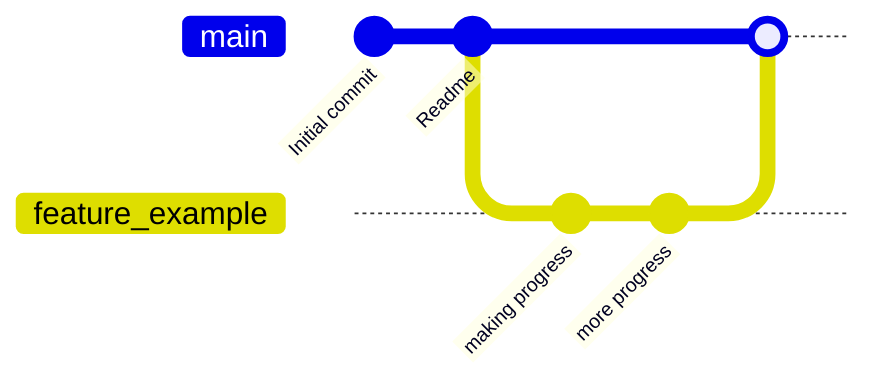
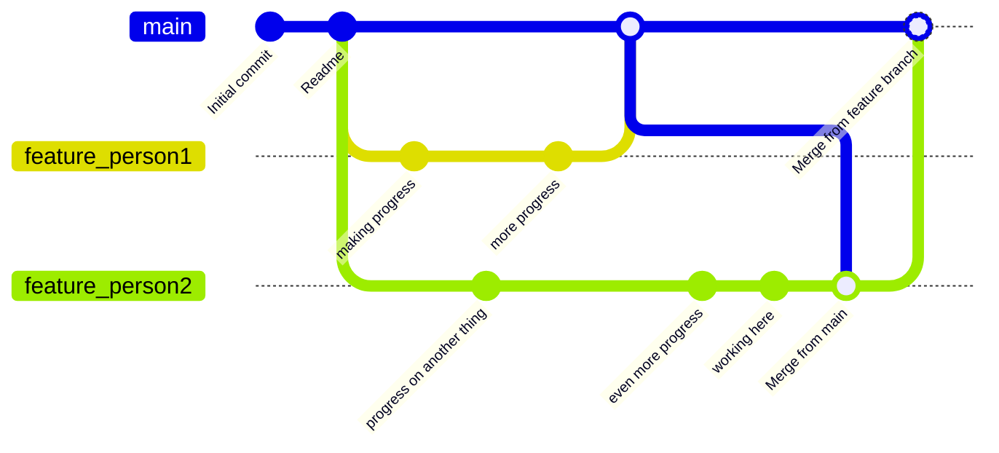

# ASDirect's Custom Bot

## Developer instructions

### Project organisation

We'll use feature branches. Do *not* commit directly to the main branch after the initial commits. Even for tiny changes.

Our process will be the following:

1) Create a feature branch from main to solve something, i.e. "feature_coolcommand1"
2) Commit your progress on that branch, and that branch only
3) Create a pull request from the branch into main



This allows multiple people to work at the same time on different features without affecting the main deploy/product.


### Running and testing

Assure all the required dependencies are installed by running `pip install -r requirements.txt`

Behaviour/acceptance testing can be run by simply calling `behave` (it'll use the default configurations in `behave.ini`).

Unit tests/code coverage can be assessed by running

```
coverage run -m unittest discover -s ./src/test/unittests -p test*.py -t ./src
coverage report
coverage lcov -o lcov.info
```