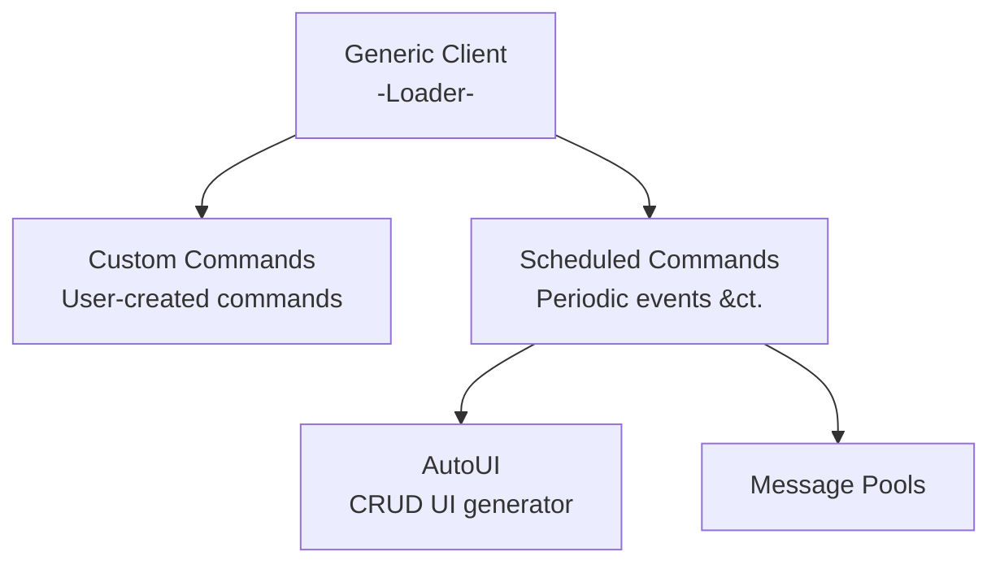
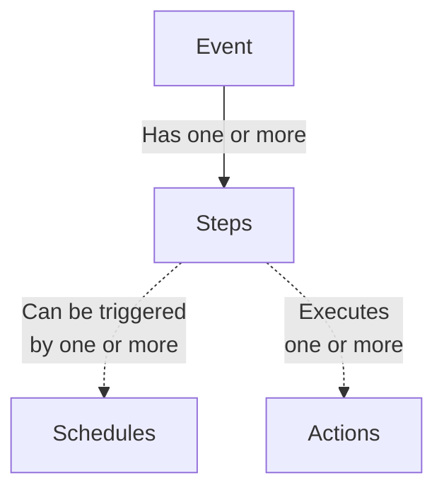

# ASDirect Bot Feature Overview/Manual

## Permission issues

Each module needs certain permissions. In summary:

To send messages, the bot needs

- Permission to *see* the channel (otherwise it'll yield a missing access error)
- Permission to *send messages* in the channel (otherwise it'll yield a missing permissions error)

To edit user permissions it needs

- Permission to *see* the channel
- Permission to *edit user permissions* **in that specific channel** (or server-wide permissions, which are usually a bad idea).
- To have its role positioned above the roles it's editing in the role list.

## Known Issues

- The bot will trigger monthly events in the wrong day (one day after, if it's a month with 30 days, one day before otherwise) if there are literally no other events between the day of setting the event and the first trigger.
- The bot will trigger any events in the wrong hour in case of DST/other leap hour situations.
- UI modals might freeze due do discord fuckery. The commands will still be executed in most cases.
- Setting role permissions in a channel will result in other inherited (`/`, rather than `X` or `V` in the settings menu) permissions resolving into `X`or `V`. I.e. if the user does not, in practice, have access to a certain permission, and the permission isn't set, it'll be set to "disallowed".

## Structure

The bot is modular, with each module keeping its own set of logs and commands.

In case a module fails to load, the others will remain functional.

## Modules



### Helper Modules

#### AutoUI

A set of tools for quickly creating user interfaces for CRUD operations on databases.

### End-user modules

#### Custom Reference Commands

A set of commands and UI modules to allow users to easily create custom commands with simple functionalities (e.g. referencing static text, images, etc.).

#### Scheduled Commands/Events

A set of commands to allow the automation of periodic moderation actions, i.e. opening and closing channels weekly, sending periodic messages (potentially pulling from a pool of options).

---

# Details

## Custom Commands

### Overview

This module exposes the following commands:

- `referencecommands manage`: For managing custom commands.
- `referencecommands sync`: For syncing the server's custom commands (in case a new command doesn't instantly appear in Discord's UI).

Commands created by this module will bring up a discord "Modal" (grey box containing assorted special items exclusive to bots) with a predetermined message and an optional image.

To reference special entities (channels, roles, users) in the message, you'll need to obtain the entity's ID (by right-clicking it and scrolling until you find the "Copy ID" option - you might need to activate developer mode). The following table indexes the different reference structures:

Assuming your ID is `12345`:
|Entity|How to reference|
|--|--|
|User|`<@12345>`|
|Channel/Thread|`<#12345>`|
|Role|`<@&12345>`|

## Scheduled Events & Message Pools

### Overview

This module exposes the following commands:

- `event add`: Adds an event to the scheduling module.
- `event pool`: Manages message pools for the messaging commands.



Events (e.g. Weekly Wonderings) have steps, which can be interpreted as "Phases". A step is a bundle of actions associated with triggering schedules.

Let's specify the steps and actions for weekly wonderings:

Event: Weekly Wonderings

Steps:

1) 
    - Schedule triggers: Weekly, Every Wednesday
    - Actions:
        - Send a message in the `#events` channel, using a template and pulling from a pool of messages
        - Send a message in the `#weekly-wonderings` channel, using a template and pulling from a pool of messages
        - Set permissions:
            - Channel: `#weekly-wonderings`
            - Role: Citizen
            - Permissions to add:
                - Send messages
2)
    - Schedule triggers: Weekly, Every Friday
    - Actions:
        - Send a message in the `#weekly-wonderings` channel announcing it's closing.
        - Set permissions:
            - Channel: `#weekly-wonderings`
            - Role: Citizen
            - Permissions to remove:
                - Send messages

### Scheduling

Scheduling works by specifying a recurrence mode (daily, weekly, monthly, yearly) and a date/time.

> Times and dates are chaotic. They'll probably be relative to the Timezone of whoever's hosting the bot. The UI will show the time in the user's timezone while they set it.

- Daily: Will trigger every day at the specified time
- Weekly: Will trigger every week at the specified time and day of the week.
- Monthly: Will trigger every month at the specified numbered day (i.e. 10th) and time.
- Yearly: Will trigger every year at the specified date and time (if it exists).

**Multiple schedules can be set for a step!** E.g. you can have a step with a trigger at 8h and 20h every day (two schedules), or have it trigger every week, plus one extra day per year or whatever.

Schedule triggers can activate steps, but not inhibit them. Come to think of it, I should probably add that someday (i.e. trigger every week except the fourth).

### Available Commands

#### Send a message

Will send a message at the specified channel as long as the bot has the required permissions.

The message can also pull from a pool of messages (i.e. for Weekly Wonderings) and insert it into a template message.

That is done by creating a pool with the `/event pool` command and inserting template replacement patterns in the message commands. A replacement pattern consists in the name of the pool between a pair of percentage signs. Here's an example:

Suppose we have a pool called `example_pool`. To use it within our message, we can write:

```
This is an example message. A pattern will be inserted here:

- %%example_pool%%

The pattern can be used multiple times per message (%%example_pool%%).

Multiple pools can be referenced: %%other_pool%%
```

Pools come in two types:
- Queue:
    - Has a default message that'll be sent when it's empty.
    - Used messages will be removed from the queue (e.g. weekly wonderings, self-kindness).
- Cyclical:
    - Used messages will be brought back to the end of the queue, in a cycle (e.g. the month names for `#birthday`).

#### Change channel permissions

Will set the specified channel permissions to the specified values (for a given set of roles, as long as the bot has the required permissions over the roles).

Due to the way discord permissions work, this will also resolve the user's permissions for that context and set them according to their actual status (i.e. there will be no "/" permissions left. Only "Allowed" or "Forbidden"). We'll investigate and find a workaround soon.